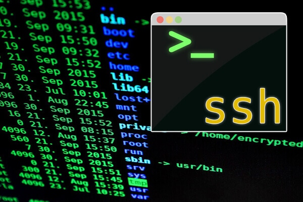

# Entrega 1: Instalación y configuración de SSH en la Raspberry Pi

## Integrantes Grupo 5

- Lorenzo Palacios
- Benjamin Fasioli
- Octavio Paez
- Ramiro Cardo
- Sebastian Weiss

## Objetivo

Instalar el sistema operativo en la tarjeta de memoria de la Raspberry Pi, iniciar el equipo y realizar su configuración inicial, junto con configurar SSH (Secure Shell) para el acceso remoto y seguro desde otras computadoras.

## Materiales utilizados

- Raspberry Pi
- Tarjeta microSD
- Monitor conectado a la Raspberry
- Cable de alimentación para la Raspberry
- Teclado conectado a la Raspberry
- Cable HDMI

## Procedimiento

Al procedimiento lo podemos dividir en 2 facetas :

### Instalación

1. Descargamos de el sitio oficial de raspberry el Raspberry Pi Imager y conectamos la tarjeta donde se instalaría el sistema operativo de la Raspberry Pi.

2. Descargamos de https://www.raspberrypi.com/software/operating-systems/ el ".img" comprimido en formato .xz del sistema operativo lite (sin Desktop Environment que seria el entorno visual y las GUIs)

3. Descomprimimos con el comando: xz -dk raspios-trixie-arm64-lite.img.xz
-d : le dice a xz que debe descomprimir el archivo
-k : le dice a xz que no elimine el archivo comprimido una vez terminado.

4. Usamos el Raspberry Pi Imager para generar el MicroSD con el sistema operativo.

5. Una vez terminado el proceso, hicimos un archivo sin extension de nombre 'ssh' en la partitura del boot, lo que le dice al setup automatico de raspberry que debe iniciar el proceso de ssh.

6. Conectamos a la Raspberry Pi el monitor con el HDMI, la fuente, el ethernet y el teclado para hacer el setup del sistema operativo.

7. Configuramos el sistema con cada prompt de el setup, seguimos los pasos de configuración inicial que aparecieron en pantalla y dejamos el equipo preparado para utilizarlo.

### Configuracion de SSH

1. Corremos hostname -I desde la raspberry para obtener la ip de ssh, para referenciarla desde otro dispositivo (nuestra pc)

2. Desde nuestra pc, nos conectamos de forma remota a la Raspberry con el comando 'ssh [Nombredeusuario]@[direccion-IP]', no nos hizo falta instalar ssh porque viene incluido en Debian

3. Comprobamos la conexion creando un archivo desde el remoto para ver si funciona con 'touch <nombre-archivo>' (touch es un comando para crear archivos) y verificando que se encuentre en la Raspberry con 'ls' (comando que lista archivos)

4. Por ultimo, por recomendacion del mensaje cuando corrimos ssh, corrimos raspi-config en la raspberry para configurar la zona horaria y el pais.

## Conclusión

Con esta actividad logramos entender como configurar entre dos computadoras un acceso remoto y seguro con SSH, y como hacer la instalación y configuración del sistema operativo Raspberry para una Raspberry Pi.

