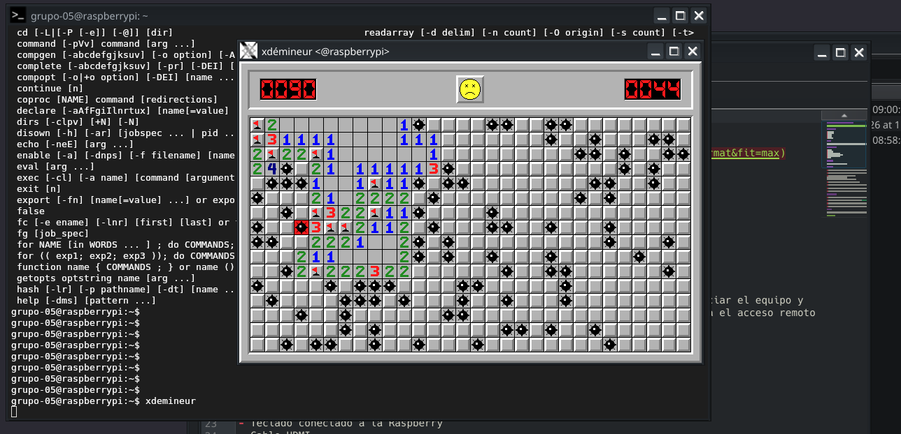

# Entrega 2: Instalación y configuración de X con SSH

## Integrantes Grupo 5

- Lorenzo Palacios
- Benjamin Fasioli
- Octavio Paez
- Ramiro Cardo
- Sebastian Weiss

## Objetivo

Configurar X11 en la raspberry para modificar la conectividad antigua con ssh entre nuestra pc y la raspberry para permitir, mediante X11, la proyección de elementos graficos a nuestra pc. 

## Materiales utilizados

- Raspberry Pi
- Tarjeta microSD
- Monitor conectado a la Raspberry
- Cable de alimentación para la Raspberry
- Teclado conectado a la Raspberry
- Cable HDMI
- Guía de https://unix.stackexchange.com/questions/12755/how-to-forward-x-over-ssh-to-run-graphics-applications-remotely
## Definiciones 

- X:
El Sistema de Ventanas X (también conocido como X11 o Xorg (su implementación más común) 'x.org server') es el software tradicional encargado de mostrar la interfaz gráfica de usuario en sistemas operativos basados en Linux.

- X11:
Se refiere a la versión número 11 del Sistema X, la más usada contemporáneamente.

¿Cómo funciona?

• Modelo cliente-servidor: Funciona separando el programa que se ejecuta (el cliente) del gestor que dibuja la pantalla y controla el hardware como el teclado, el ratón y la tarjeta gráfica (el servidor X).
## Procedimiento

1. Cambiamos el archivo de configuración ssh (/etc/ssh/sshd_config) del lado server (la raspberry) para añadir el argumento 'X11Forwarding yes'. Usamos como comando sudo nano <ruta-del-archivo>. En el cual:
- sudo: 'superuser do' corre con privilegios aumentados el nano (porque estamos operando archivos de configuración sensibles)
- nano: editor de texto innato de la mayoría de sistemas linux operado desde la terminal

2. Descubrimos que el programa para la autenticación de X11 para forwarding ya vino preinstalado entonces no nos hizo falta instalarlo con el comando sudo apt install xauth. Donde:
- sudo: explicado previamente
- apt: 'advanced package tool' administrador de paquetes en sistemas basados en Debian.
- install: argumento de instalación de apt

3. Del lado cliente (nuestra pc), no hizo falta configurar o instalar nada porque ambos lados de la operación (cliente y server) son sistemas basados en Debian y son naturalmente compatibles, además de ya tener todos los paquetes importantes de X11 instalados ya que es una computadora de uso comun.

4. Corremos casi el mismo comando ssh para conenctarnos con la única diferencia de que ahora añadimos el argumento '-X' al ssh, lo que permite el forwarding X11 y lo autentifica con xauth.

5. Por último, una vez conectados al server con ssh, comprobamos el forwarding instalando y corriendo una version aligerada y con pocas librerias de buscaminas, y transmitiendo los gráficos al cliente.

## Conclusión

Con esta actividad logramos usar y configurar el forwarding de gráficos con el protocolo X11 y SSH, pudiendo profundizar la complejidad del proceso para la eventual configuración de la raspberry como router.

Demostracion del funcionamiento abriendo una ventana de buscaminas desde el ssh remoto:

